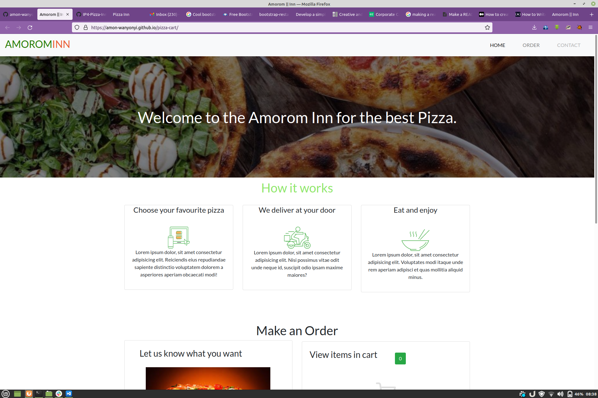
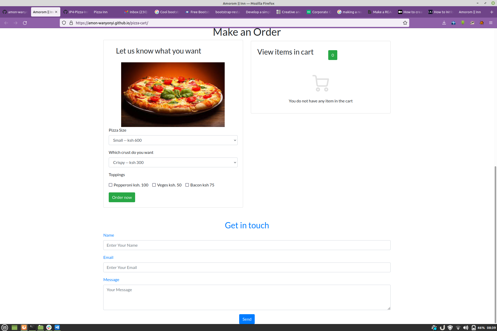

## AMOROM INN

### Author: Amon Wanyonyi

#### Description
This web application for for Amorom Inn, where it allows the user to order for pizza, the user chooses the brand he/she wants, the selects the topping.  
The application shows the user his/her cart items, the total cost to pay over the counter or on delivery. 

### Technologies Used
-Bootstrap 5  
-CSS  
-HTML  
-JavaScript  
-JQuery

## Setup Instructios
Download of git clone the repository  
To git clone, Copy the repository URL  
Open the terminal 
Change the directory to the location you want  
Type git clone, paste the URL you copies and hit enter

## Contact Information
For more information and questions, feel free to contact me through this mail
xxx110680@gmail.com or mc.max.aw@gmail.com
License